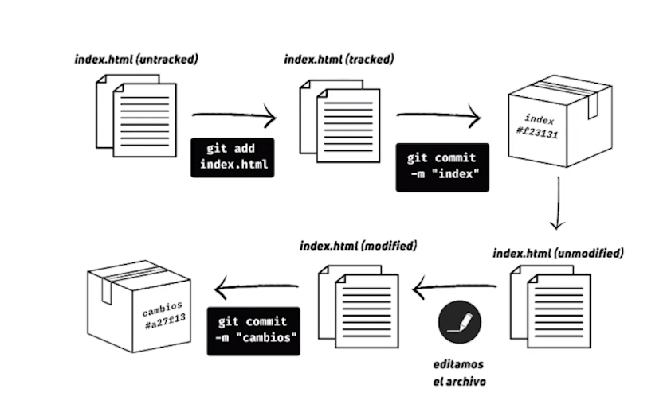

# Aprendiendo-github

## Comandos de ruta
**pwd**: mostrar la ruta completa de el directorio

> /d/Documents/Visual Studio/Git test

**ls**: lista todos los archivos dentro de la carpeta actual (-a lista archivos ocultos)

> 'Git procedimiento.png'   imgs/   index.html   principal/   README.md   styles.css

**cd**: utilizado para moverse por carpetas y directorios ('..' utilizado para ir para atras)

> cd imgs

>> /d/Documents/Visual Studio/Git test/imgs

**mkdir**: crea carpetas (mkdir -p /<ruta>/<nombre> crea directorios anidados)

> mkdir testfolder
>> /d/Documents/Visual Studio/Git test/testfolder

**touch**: crea archivos (especifica la extension)

> touch index.html

**rm**: borrar archivos (-r borra la carpeta y las subcarpetas dentro)

> rm -r testfolder
> rm index.html

**mv**: mueve un archivo (mv <nombre_antiguo> <nombre_actual> renombra el archivo, mv <nombre> <direccion_nueva> mueve el archivo)

> mv index.html main.html
> mv main.html imgs

**cp**: cp <nombre> <nombre_copia> copia archivo bajo nuevo nombre (-r copia los subdirectorios tambien)

> cp main.html index.html

## Git bash configuraciones

git config --global user.name "Tu Nombre"

git config --global user.email tucorreo@mail.com

git config --list

## Git comandos para repositorio

**git clone url_repositorio_a_copiar**: clona el repositorio indicado en el tercer campo

**git remote add origin url_repositorio**: define el origen al cual todos los git push van a ir destinados

**git status**: muestra el estado actual del repositorio, incluyendo archivos modificados y sin seguimiento

**git add**: agrega archivos al sistema de tracking de git (pasamos de untracked a tracked)

**git commit -m "mensaje"**: empaqueta todos los cambios

**git log**: muestra un registro de commits en orden cronologico inverso

**git push origin nombre_rama**: sube los cambios al repositorio

**git pull origin nombre_rama**: descarga los cambios del repositorio remoto y los fusiona con los cambios locales

## Generacion de llave SSH

**ssh-keygen -t rsa -b 4096 -C "clave"**: crea clave SSH

**eval "$(ssh-agent -s)"**: linkea la clave con la terminal

**ssh-add ~/.ssh/id_rsa**: agrega los datos al agente de seguimiento
